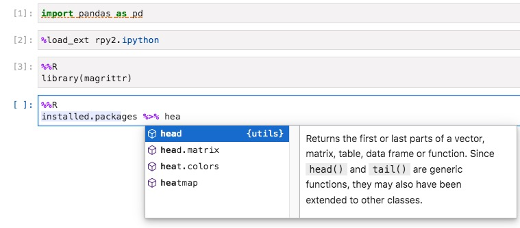

# Pyrcache

The Dockerfile and scripts for building the docker image ljmljm/pyrcache in Docker Hub.

The resulting image is an ubuntu-based image integrated with python, Jupyterlab, R and RStudio. Python and R can be utilized simultaneously more easily through Jupyterlab, as well as RStudio.   

# Features

> Call python code in R

- RStudio Server enabled;  
- The reticulate package pre-installed.

> Call R code in python

- Jupyterlab enabled;  
- Rmagics of rpy2 supported;  
- Auto-completion enabled for both python code and R code in Rmagics.

> Pre-installed packages and modules

R packages and python modules involved in GC **RNA_pipeline** and **WES_pepeline** were installed already.

# Build and run

1. Build a docker image

    Clone the code to your directory and build an image, let's name it ***pyrcache***. Building the image for the first time may take a few hours.
    ```
    cd /path/to/Dockerfile
    docker build -t pyrcache .
    ```
    If the image is to used as a cache source, run the following instead.
    ```
    DOCKER_BUILDKIT=1 docker build -t ljmljm/pyrcache --build-arg BUILDKIT_INLINE_CACHE=1 .
    ```

2. Run a container

    After building the aforementioned ***pyrcache*** image, a container can be created to run the services.  
    Suppose you want to:  
    - run RStudio on port 12000 on the host machine;  
    - run Jupyterlab on port 12001;  
    - set passwords for RStudio and Jupyterlab both to 'yourPassWord' (username for RStudio: rstudio);
    - mount host's directory /GCI/foobar onto the container; 
    - set Jupyterlab working directory to /GCI/foobar;
    - name the container 'pyrcacheCon'
    
    Run
    ```
    docker run -d -p 12000:8787 -p 12001:8888 \
        -e PASSWORD=yourPassWord \
        -v /GCI/foobar:/GCI/foobar \
        -e NOTEBOOKDIR=/GCI/foobar \
        --name pyrcacheCon pyrcache
    ```

3. Log in on the webpage

    Jupyterlab and RStudio will run on the specified port of the host. Log in to Jupyterlab or RStudio using the passwords set in the previous step. It's worth noting that RStudio username defaults to 'rstudio'.

4. Container operation

    ```
    # Check status of the container pyrcacheCon
    docker ps -a | grep pyrcacheCon

    # View the latest 200 log records
    docker logs -n 200 pyrcacheCon

    # Get into the bash env in the running container
    docker exec -it pyrcacheCon /bin/bash
    ```

# Use python and R in Jupyterlab
    To use python and R in one notebook, just load rpy2.ipython extension. :+1:



# Add more packages or modules

Write a batch of installation commands into a bash script (see `setup_py.sh` or `setup_R.sh`), and add it into `Dockerfile` as a new layer.

# Others
RStudio is a registered trademark of RStudio, Inc. Please review [RStudio's policy](http://www.rstudio.com/about/trademark/) and address inquiries about further distribution. This repository wouldn't exist without [rocker](https://github.com/rocker-org/rocker).
